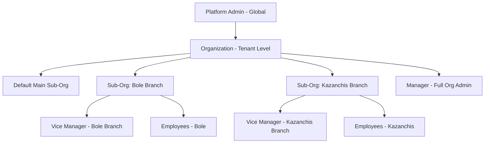
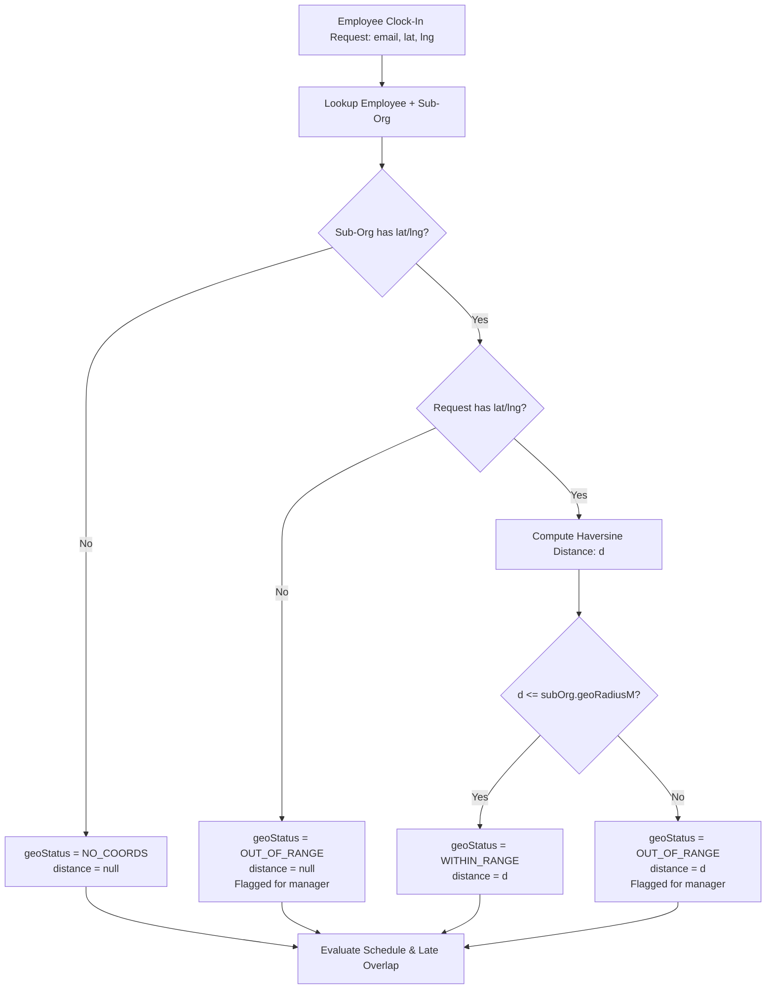
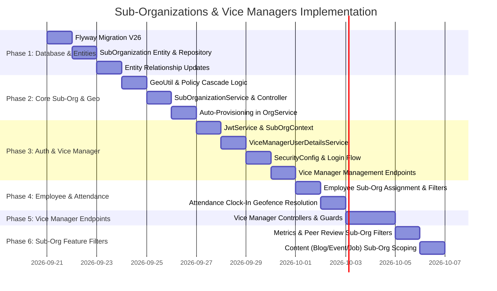

# Sub-Organizations & Vice Managers Architecture & Implementation Blueprint (v3 — Complete)

## Executive Summary

This document provides the complete, production-ready specification for introducing **Sub-Organizations** and **Vice Managers** into the `afrodebab-cms-api` platform.

### Core Objectives
1. **Multi-Sub-Organization Support**: Organizations can operate multiple physical branches or logical divisions, each with its own coordinates and attendance policy.
2. **Zero-Friction Default**: Every organization automatically gets a default `"Main"` sub-organization upon provisioning. Single-branch organizations never have to manage multiple sub-orgs; they can simply configure their main office location and attendance policy anytime.
3. **Map-Based Geofencing**: Sub-organizations store latitude, longitude, and geofence radius. The mobile/web attendance clock-in captures GPS coordinates and resolves geofence compliance (`WITHIN_RANGE`, `OUT_OF_RANGE`, `NO_COORDS`).
4. **Cascading Attendance Policies**: Each sub-organization can define its own work schedule (entry time, exit time, grace minutes / late overlap tolerance, lunch window). If undefined, it falls back seamlessly to the global `AttendancePolicyProperties`.
5. **Vice Manager Role**: Sub-organization-specific administrative role with read-only visibility into employee lists, attendance, peer reviews, and performance metrics for their assigned sub-org. Vice managers cannot create or edit jobs, hire employees, or modify org-level resources.

---

## 1. System Architecture & Tenancy Hierarchy



### Tenancy & Scoping Strategy
- **`organization_id` remains the Hibernate `@TenantId`**: All data isolation across different companies continues to be strictly enforced at the database and query level via `TenantContext` and `TenantEntity`.
- **Sub-organization is an entity-level dimension**: It groups employees, branch settings, and resources within the same organization tenant without altering the multi-tenancy core.
- **Vice Managers authenticate via the same endpoint (`/manager/auth/login`)**: The issued JWT contains `role: "VICE_MANAGER"`, `orgId: <orgId>`, and `subOrgId: <subOrgId>`.
- **Vice Manager operations are isolated**: Routes under `/vice-manager/**` enforce `ROLE_VICE_MANAGER` and constrain all queries to `SubOrgContext.get()`.

---

## 2. Complete Database Migration Script (`V26__sub_organizations_and_vice_managers.sql`)

Below is the complete, idempotent Flyway migration file:

```sql
-- ====================================================================
-- Flyway Migration: V26__sub_organizations_and_vice_managers.sql
-- Description: Sub-organizations, geo-coordinates, per-branch policies,
--              and Vice Manager role support.
-- ====================================================================

-- 1. Create sub_organizations table
CREATE TABLE IF NOT EXISTS sub_organizations (
    id                      BIGINT GENERATED BY DEFAULT AS IDENTITY PRIMARY KEY,
    organization_id         BIGINT NOT NULL,
    name                    VARCHAR(255) NOT NULL,
    slug                    VARCHAR(255) NOT NULL,
    is_default              BOOLEAN NOT NULL DEFAULT false,
    
    -- Geofence & Map Coordinates (WGS-84)
    latitude                DOUBLE PRECISION,
    longitude               DOUBLE PRECISION,
    geo_radius_m            INTEGER DEFAULT 200,
    address_label           VARCHAR(500),
    
    -- Sub-org specific attendance policy overrides (NULL = inherit global default)
    entry_time              TIME,
    exit_time               TIME,
    lunch_start_time        TIME,
    lunch_end_time          TIME,
    grace_minutes           INTEGER,
    max_lunch_break_minutes INTEGER,
    
    created_at              TIMESTAMPTZ NOT NULL DEFAULT now(),
    updated_at              TIMESTAMPTZ NOT NULL DEFAULT now(),
    
    CONSTRAINT fk_sub_organizations_org 
        FOREIGN KEY (organization_id) REFERENCES organizations(id) ON DELETE CASCADE,
    CONSTRAINT uk_sub_org_org_slug 
        UNIQUE (organization_id, slug),
    CONSTRAINT uk_sub_org_org_name 
        UNIQUE (organization_id, name)
);

-- Partial index: only one default sub-org per organization
CREATE UNIQUE INDEX IF NOT EXISTS idx_sub_org_one_default 
    ON sub_organizations (organization_id) 
    WHERE is_default = true;

CREATE INDEX IF NOT EXISTS idx_sub_org_org 
    ON sub_organizations (organization_id);

-- 2. Populate default sub-org for all existing organizations
INSERT INTO sub_organizations (organization_id, name, slug, is_default, created_at, updated_at)
SELECT o.id, o.name || ' Main', 'main', true, now(), now()
FROM organizations o
WHERE NOT EXISTS (
    SELECT 1 FROM sub_organizations so 
    WHERE so.organization_id = o.id AND so.is_default = true
);

-- 3. Add sub_organization_id to employees
ALTER TABLE employees 
    ADD COLUMN IF NOT EXISTS sub_organization_id BIGINT;

-- Backfill existing employees to their organization's default sub-org
UPDATE employees e
SET sub_organization_id = (
    SELECT so.id 
    FROM sub_organizations so 
    WHERE so.organization_id = e.organization_id AND so.is_default = true
)
WHERE e.sub_organization_id IS NULL;

-- Make sub_organization_id NOT NULL and add foreign key
ALTER TABLE employees 
    ALTER COLUMN sub_organization_id SET NOT NULL;

DO $$
BEGIN
    IF NOT EXISTS (
        SELECT 1 FROM pg_constraint WHERE conname = 'fk_employees_sub_organization'
    ) THEN
        ALTER TABLE employees 
            ADD CONSTRAINT fk_employees_sub_organization 
            FOREIGN KEY (sub_organization_id) REFERENCES sub_organizations(id);
    END IF;
END $$;

CREATE INDEX IF NOT EXISTS idx_employees_sub_organization 
    ON employees (sub_organization_id);

-- 4. Update managers table to support Vice Managers
ALTER TABLE managers 
    ADD COLUMN IF NOT EXISTS role VARCHAR(30) NOT NULL DEFAULT 'MANAGER';

ALTER TABLE managers 
    ADD COLUMN IF NOT EXISTS sub_organization_id BIGINT;

DO $$
BEGIN
    IF NOT EXISTS (
        SELECT 1 FROM pg_constraint WHERE conname = 'fk_managers_sub_organization'
    ) THEN
        ALTER TABLE managers 
            ADD CONSTRAINT fk_managers_sub_organization 
            FOREIGN KEY (sub_organization_id) REFERENCES sub_organizations(id) ON DELETE SET NULL;
    END IF;
END $$;

CREATE INDEX IF NOT EXISTS idx_managers_sub_organization 
    ON managers (sub_organization_id);

-- 5. Add coordinates and geofence tracking to employee_attendance
ALTER TABLE employee_attendance 
    ADD COLUMN IF NOT EXISTS clock_in_lat DOUBLE PRECISION;

ALTER TABLE employee_attendance 
    ADD COLUMN IF NOT EXISTS clock_in_lng DOUBLE PRECISION;

ALTER TABLE employee_attendance 
    ADD COLUMN IF NOT EXISTS geo_status VARCHAR(30);

ALTER TABLE employee_attendance 
    ADD COLUMN IF NOT EXISTS clock_in_distance_m DOUBLE PRECISION;

-- 6. Add optional sub-organization scoping to content entities
ALTER TABLE blogs 
    ADD COLUMN IF NOT EXISTS sub_organization_id BIGINT;

DO $$
BEGIN
    IF NOT EXISTS (
        SELECT 1 FROM pg_constraint WHERE conname = 'fk_blogs_sub_organization'
    ) THEN
        ALTER TABLE blogs 
            ADD CONSTRAINT fk_blogs_sub_organization 
            FOREIGN KEY (sub_organization_id) REFERENCES sub_organizations(id) ON DELETE SET NULL;
    END IF;
END $$;

ALTER TABLE events 
    ADD COLUMN IF NOT EXISTS sub_organization_id BIGINT;

DO $$
BEGIN
    IF NOT EXISTS (
        SELECT 1 FROM pg_constraint WHERE conname = 'fk_events_sub_organization'
    ) THEN
        ALTER TABLE events 
            ADD CONSTRAINT fk_events_sub_organization 
            FOREIGN KEY (sub_organization_id) REFERENCES sub_organizations(id) ON DELETE SET NULL;
    END IF;
END $$;

ALTER TABLE jobs 
    ADD COLUMN IF NOT EXISTS sub_organization_id BIGINT;

DO $$
BEGIN
    IF NOT EXISTS (
        SELECT 1 FROM pg_constraint WHERE conname = 'fk_jobs_sub_organization'
    ) THEN
        ALTER TABLE jobs 
            ADD CONSTRAINT fk_jobs_sub_organization 
            FOREIGN KEY (sub_organization_id) REFERENCES sub_organizations(id) ON DELETE SET NULL;
    END IF;
END $$;

CREATE INDEX IF NOT EXISTS idx_blogs_sub_org ON blogs (sub_organization_id);
CREATE INDEX IF NOT EXISTS idx_events_sub_org ON events (sub_organization_id);
CREATE INDEX IF NOT EXISTS idx_jobs_sub_org ON jobs (sub_organization_id);
```

---

## 3. Detailed Data Models & Entity Implementations

### 3.1 `SubOrganization` Entity
**Path:** `src/main/java/com/afrodebab/cms/jpa/entity/SubOrganization.java`

```java
package com.afrodebab.cms.jpa.entity;

import com.afrodebab.cms.tenant.TenantEntity;
import jakarta.persistence.*;
import lombok.AllArgsConstructor;
import lombok.Data;
import lombok.EqualsAndHashCode;
import lombok.NoArgsConstructor;
import lombok.experimental.SuperBuilder;

import java.time.Instant;
import java.time.LocalTime;

@Data
@EqualsAndHashCode(callSuper = true)
@Entity
@Table(
        name = "sub_organizations",
        uniqueConstraints = {
                @UniqueConstraint(name = "uk_sub_org_org_slug", columnNames = {"organization_id", "slug"}),
                @UniqueConstraint(name = "uk_sub_org_org_name", columnNames = {"organization_id", "name"})
        }
)
@SuperBuilder
@NoArgsConstructor
@AllArgsConstructor
public class SubOrganization extends TenantEntity {

    @Id
    @GeneratedValue(strategy = GenerationType.IDENTITY)
    private Long id;

    @Column(nullable = false)
    private String name;

    @Column(nullable = false)
    private String slug;

    @Column(name = "is_default", nullable = false)
    private boolean isDefault = false;

    // --- Geofence Coordinates ---
    @Column(name = "latitude")
    private Double latitude;

    @Column(name = "longitude")
    private Double longitude;

    @Column(name = "geo_radius_m")
    private Integer geoRadiusM = 200;

    @Column(name = "address_label")
    private String addressLabel;

    // --- Sub-Org Attendance Overrides ---
    @Column(name = "entry_time")
    private LocalTime entryTime;

    @Column(name = "exit_time")
    private LocalTime exitTime;

    @Column(name = "lunch_start_time")
    private LocalTime lunchStartTime;

    @Column(name = "lunch_end_time")
    private LocalTime lunchEndTime;

    @Column(name = "grace_minutes")
    private Integer graceMinutes;

    @Column(name = "max_lunch_break_minutes")
    private Integer maxLunchBreakMinutes;

    @Column(name = "created_at", nullable = false, updatable = false)
    private Instant createdAt;

    @Column(name = "updated_at", nullable = false)
    private Instant updatedAt;

    @PrePersist
    void prePersist() {
        createdAt = Instant.now();
        updatedAt = createdAt;
    }

    @PreUpdate
    void preUpdate() {
        updatedAt = Instant.now();
    }
}
```

### 3.2 `Manager` Entity Updates
**Path:** `src/main/java/com/afrodebab/cms/jpa/entity/Manager.java`

Add `ManagerRole` and `subOrganization`:
```java
public enum ManagerRole {
    MANAGER,
    VICE_MANAGER
}

@Enumerated(EnumType.STRING)
@Column(name = "role", nullable = false)
@Builder.Default
private ManagerRole role = ManagerRole.MANAGER;

@ManyToOne(fetch = FetchType.LAZY)
@JoinColumn(name = "sub_organization_id")
private SubOrganization subOrganization;
```

### 3.3 `Employee` Entity Updates
**Path:** `src/main/java/com/afrodebab/cms/jpa/entity/Employee.java`

```java
@ManyToOne(fetch = FetchType.LAZY, optional = false)
@JoinColumn(name = "sub_organization_id", nullable = false)
private SubOrganization subOrganization;
```

### 3.4 `EmployeeAttendance` Entity Updates
**Path:** `src/main/java/com/afrodebab/cms/jpa/entity/EmployeeAttendance.java`

```java
public enum GeoStatus {
    WITHIN_RANGE,
    OUT_OF_RANGE,
    NO_COORDS
}

@Column(name = "clock_in_lat")
private Double clockInLat;

@Column(name = "clock_in_lng")
private Double clockInLng;

@Enumerated(EnumType.STRING)
@Column(name = "geo_status")
private GeoStatus geoStatus;

@Column(name = "clock_in_distance_m")
private Double clockInDistanceM;
```

---

## 4. Maps Integration & Geofencing Contract

### 4.1 Coordinate Validation & Coordinate System
- Coordinate standard: **WGS-84** (standard GPS coordinates supplied by browser `navigator.geolocation` or mobile apps).
- Latitude validation: `@DecimalMin("-90.0") @DecimalMax("90.0")`
- Longitude validation: `@DecimalMin("-180.0") @DecimalMax("180.0")`
- Default Geofence Radius: 200 meters (configurable per sub-organization from 20m up to 10,000m).

### 4.2 Distance Calculation Utility (`GeoUtil.java`)
**Path:** `src/main/java/com/afrodebab/cms/util/GeoUtil.java`

```java
package com.afrodebab.cms.util;

public final class GeoUtil {

    private static final double EARTH_RADIUS_METERS = 6371000.0;

    private GeoUtil() {}

    /**
     * Calculates the great-circle distance between two latitude/longitude points using Haversine formula.
     *
     * @return Distance in meters
     */
    public static double distanceMeters(double lat1, double lon1, double lat2, double lon2) {
        double dLat = Math.toRadians(lat2 - lat1);
        double dLon = Math.toRadians(lon2 - lon1);

        double a = Math.sin(dLat / 2) * Math.sin(dLat / 2)
                + Math.cos(Math.toRadians(lat1)) * Math.cos(Math.toRadians(lat2))
                * Math.sin(dLon / 2) * Math.sin(dLon / 2);

        double c = 2 * Math.atan2(Math.sqrt(a), Math.sqrt(1 - a));
        return EARTH_RADIUS_METERS * c;
    }
}
```

### 4.3 Geofence Resolution Matrix on Clock-In



---

## 5. Attendance Policy Cascade & Late Overlap Resolution

Each sub-organization inherits from the global `AttendancePolicyProperties` unless explicitly customized.

### Effective Policy Container
```java
public record EffectiveAttendancePolicy(
        LocalTime entryTime,
        LocalTime exitTime,
        LocalTime lunchStartTime,
        LocalTime lunchEndTime,
        int graceMinutes,
        int maxLunchBreakMinutes
) {}
```

### Cascade Resolution in `EmployeeAttendanceService`
```java
public EffectiveAttendancePolicy resolvePolicy(SubOrganization subOrg) {
    LocalTime entry = subOrg.getEntryTime() != null 
            ? subOrg.getEntryTime() 
            : attendancePolicyProperties.getEntryTime();
    LocalTime exit = subOrg.getExitTime() != null 
            ? subOrg.getExitTime() 
            : attendancePolicyProperties.getExitTime();
    LocalTime lunchStart = subOrg.getLunchStartTime() != null 
            ? subOrg.getLunchStartTime() 
            : attendancePolicyProperties.getLunchStartTime();
    LocalTime lunchEnd = subOrg.getLunchEndTime() != null 
            ? subOrg.getLunchEndTime() 
            : attendancePolicyProperties.getLunchEndTime();
    int grace = subOrg.getGraceMinutes() != null 
            ? subOrg.getGraceMinutes() 
            : attendancePolicyProperties.getGraceMinutes();
    int maxLunch = subOrg.getMaxLunchBreakMinutes() != null 
            ? subOrg.getMaxLunchBreakMinutes() 
            : attendancePolicyProperties.getMaxLunchBreakMinutes();

    return new EffectiveAttendancePolicy(entry, exit, lunchStart, lunchEnd, grace, maxLunch);
}
```

### Lateness Determination (Allowed Minute Overlap)
```java
EffectiveAttendancePolicy policy = resolvePolicy(employee.getSubOrganization());
LocalTime lateThreshold = policy.entryTime().plusMinutes(policy.graceMinutes());
LocalTime clockInTime = clockInInstant.atZone(ZoneOffset.UTC).toLocalTime();

if (clockInTime.isAfter(lateThreshold)) {
    attendanceStatus.put("ENTRY", "LATE_IN");
    finalStatus = AttendanceFinalStatus.LATE;
} else {
    attendanceStatus.put("ENTRY", "ON_TIME");
    finalStatus = AttendanceFinalStatus.ON_TIME;
}
```

---

## 6. Authentication, Security & Context Scoping

### 6.1 `SubOrgContext` (Thread-Local Context)
**Path:** `src/main/java/com/afrodebab/cms/tenant/SubOrgContext.java`

```java
package com.afrodebab.cms.tenant;

import java.util.function.Supplier;

public final class SubOrgContext {

    private static final ThreadLocal<Long> CURRENT_SUB_ORG = new ThreadLocal<>();

    private SubOrgContext() {}

    public static void set(Long subOrgId) {
        CURRENT_SUB_ORG.set(subOrgId);
    }

    public static Long get() {
        return CURRENT_SUB_ORG.get();
    }

    public static void clear() {
        CURRENT_SUB_ORG.remove();
    }

    public static <T> T callAs(Long subOrgId, Supplier<T> work) {
        Long previous = get();
        try {
            set(subOrgId);
            return work.get();
        } finally {
            if (previous != null) {
                set(previous);
            } else {
                clear();
            }
        }
    }
}
```

### 6.2 `JwtService` Enhancements
**Path:** `src/main/java/com/afrodebab/cms/service/JwtService.java`

Update `generateToken` and parsing methods:
```java
public String generateToken(String subjectEmail, String role, Long orgId, Long subOrgId) {
    Instant now = Instant.now();
    Instant exp = now.plus(expiresMinutes, ChronoUnit.MINUTES);

    var claims = new HashMap<String, Object>();
    claims.put("role", role);
    if (orgId != null) claims.put("orgId", orgId);
    if (subOrgId != null) claims.put("subOrgId", subOrgId);

    return Jwts.builder()
            .subject(subjectEmail)
            .claims(claims)
            .issuedAt(Date.from(now))
            .expiration(Date.from(exp))
            .signWith(key)
            .compact();
}

public Long extractSubOrgId(String token) {
    Object subOrgId = Jwts.parser()
            .verifyWith(key)
            .build()
            .parseSignedClaims(token)
            .getPayload()
            .get("subOrgId");
    return subOrgId == null ? null : Long.valueOf(subOrgId.toString());
}
```

### 6.3 `JwtAuthFilter` Processing
**Path:** `src/main/java/com/afrodebab/cms/security/JwtAuthFilter.java`

```java
Long orgId = jwtService.extractOrgId(token);
Long subOrgId = jwtService.extractSubOrgId(token);

if (orgId != null) {
    TenantContext.set(orgId);
}
if (subOrgId != null) {
    SubOrgContext.set(subOrgId);
}

// User details mapping
UserDetails user = switch (role) {
    case "ADMIN" -> platformAdminUserDetailsService.loadUserByUsername(email);
    case "MANAGER" -> managerUserDetailsService.loadUserByUsername(email);
    case "VICE_MANAGER" -> viceManagerUserDetailsService.loadUserByUsername(email);
    case "EMPLOYEE" -> employeeUserDetailsService.loadUserByUsername(email);
    default -> throw new IllegalArgumentException("Unknown token role");
};
```
In `finally` block:
```java
TenantContext.clear();
SubOrgContext.clear();
```

### 6.4 `SecurityConfig` Route Configuration
**Path:** `src/main/java/com/afrodebab/cms/security/SecurityConfig.java`

```java
.authorizeHttpRequests(auth -> auth
    // ... public swagger & auth routes ...
    .requestMatchers("/admin/auth/**").permitAll()
    .requestMatchers("/manager/auth/**").permitAll()
    .requestMatchers("/employee/auth/**").permitAll()
    .requestMatchers("/public/**").permitAll()
    
    // Attendance clock-in is public (verified via clientKey and email lookup)
    .requestMatchers(
        HttpMethod.POST,
        "/employee/me/clock-in",
        "/employee/me/clock-out",
        "/employee/me/lunch-break-in",
        "/employee/me/lunch-break-out"
    ).permitAll()

    // Platform admin routes
    .requestMatchers("/admin/**").hasRole("ADMIN")
    
    // Full Manager routes
    .requestMatchers("/manager/**").hasRole("MANAGER")
    
    // Vice Manager routes
    .requestMatchers("/vice-manager/**").hasRole("VICE_MANAGER")
    
    // Employee routes
    .requestMatchers("/employee/me/**").hasRole("EMPLOYEE")
    
    .anyRequest().permitAll()
)
```

---

## 7. Complete API Specification

### 7.1 Manager — Sub-Organizations Management (`/manager/sub-organizations`)

#### 1. `POST /manager/sub-organizations`
Creates a new sub-organization with coordinates and optional attendance policy.
- **Access**: `ROLE_MANAGER`
- **Request Body**:
```json
{
  "name": "Bole Sub-City Branch",
  "slug": "bole-branch",
  "latitude": 9.0012,
  "longitude": 38.7845,
  "geoRadiusM": 150,
  "addressLabel": "Cameroon St, Bole, Addis Ababa",
  "entryTime": "08:30",
  "exitTime": "17:30",
  "lunchStartTime": "12:00",
  "lunchEndTime": "13:00",
  "graceMinutes": 15,
  "maxLunchBreakMinutes": 60
}
```
- **Response**: `200 OK`
```json
{
  "id": 2,
  "name": "Bole Sub-City Branch",
  "slug": "bole-branch",
  "isDefault": false,
  "latitude": 9.0012,
  "longitude": 38.7845,
  "geoRadiusM": 150,
  "addressLabel": "Cameroon St, Bole, Addis Ababa",
  "entryTime": "08:30:00",
  "exitTime": "17:30:00",
  "lunchStartTime": "12:00:00",
  "lunchEndTime": "13:00:00",
  "graceMinutes": 15,
  "maxLunchBreakMinutes": 60,
  "employeeCount": 0,
  "viceManagerCount": 0,
  "createdAt": "2026-09-21T01:00:00Z",
  "updatedAt": "2026-09-21T01:00:00Z"
}
```

#### 2. `GET /manager/sub-organizations`
Lists all sub-organizations in the manager's tenant, including the default one.
- **Access**: `ROLE_MANAGER`
- **Response**: `200 OK` (Array of `SubOrganizationResponse`)

#### 3. `GET /manager/sub-organizations/{id}`
Returns details of a specific sub-organization.
- **Access**: `ROLE_MANAGER`

#### 4. `PUT /manager/sub-organizations/{id}`
Updates details, coordinates, or attendance policy of any sub-org (including the default main sub-org).
- **Access**: `ROLE_MANAGER`
- **Request Body**: Same fields as creation (all fields optional).

#### 5. `DELETE /manager/sub-organizations/{id}`
Deletes a sub-organization.
- **Constraints**:
  - Cannot delete the default sub-organization (`BadRequestException`).
  - Cannot delete a sub-organization if active employees are assigned to it (`BadRequestException: "Cannot delete sub-organization with 5 assigned employees. Reassign them first."`).
  - Automatically disassociates any Vice Managers assigned to it.

#### 6. `PATCH /manager/sub-organizations/{id}/rename`
Convenience endpoint for quickly renaming a sub-org or renaming the initial default sub-org.
- **Request Body**: `{ "name": "Headquarters" }`

---

### 7.2 Manager — Vice Managers Management (`/manager/vice-managers`)

#### 1. `POST /manager/vice-managers`
Provisions a new Vice Manager for a specific sub-organization.
- **Access**: `ROLE_MANAGER`
- **Request Body**:
```json
{
  "name": "Sarah Connor",
  "email": "sarah.connor@example.com",
  "subOrganizationId": 2
}
```
- **Behavior**:
  - Validates `subOrganizationId` belongs to the manager's organization.
  - Checks email uniqueness globally across `platform_admins`, `managers`, and `employees`.
  - Generates a secure random 12-character password.
  - Encrypts password with BCrypt.
  - Queues welcome email with temporary credentials via `EmailNotificationService`.
- **Response**: `200 OK` (`ViceManagerResponse`)

#### 2. `GET /manager/vice-managers`
Lists all vice managers in the organization.
- **Access**: `ROLE_MANAGER`
- **Response**:
```json
[
  {
    "id": 10,
    "name": "Sarah Connor",
    "email": "sarah.connor@example.com",
    "active": true,
    "subOrganizationId": 2,
    "subOrganizationName": "Bole Sub-City Branch",
    "createdAt": "2026-09-21T01:15:00Z"
  }
]
```

#### 3. `PUT /manager/vice-managers/{id}`
Updates name or reassigns Vice Manager to a different sub-organization.
- **Access**: `ROLE_MANAGER`
- **Request Body**:
```json
{
  "name": "Sarah Connor",
  "subOrganizationId": 3,
  "active": true
}
```

#### 4. `DELETE /manager/vice-managers/{id}`
Deactivates or removes a Vice Manager account.

---

### 7.3 Manager — Employee Assignment & Sub-Org Filtering

#### Employee Creation with Sub-Org Assignment
- `POST /manager/employees` and `POST /manager/employees/form`
- Field `subOrganizationId`:
  - If provided: Validated that it belongs to the manager's organization.
  - If omitted/null: Automatically assigns the organization's **default sub-organization**.

#### Employee Reassignment
- `PUT /manager/employees/{id}`
- Field `subOrganizationId`: Can be updated anytime to transfer an employee between branches.

#### Filtered Employee List
- `GET /manager/employees?subOrganizationId=2&page=0&size=20`

#### Hiring Workflow Integration
- `POST /manager/job-applications/{jobId}/hire`
- `HireCandidateRequest`: Optional `subOrganizationId`. If null, inherits `job.subOrganizationId`. If job has no sub-org, falls back to the default sub-org.

---

### 7.4 Public / Employee — Geofenced Clock-In (`POST /employee/me/clock-in`)

- **URL**: `POST /employee/me/clock-in`
- **Access**: Public (clientKey protected)
- **Request Body**:
```json
{
  "email": "abel.tsegaye@example.com",
  "latitude": 9.0014,
  "longitude": 38.7842
}
```
- **Processing**:
  1. Resolves employee by email across all tenants.
  2. Resolves employee's `SubOrganization`.
  3. Evaluates Haversine distance against `subOrg.latitude/longitude`.
  4. Resolves attendance status (`ON_TIME` or `LATE`) against `subOrg` policy (or fallback).
  5. Saves attendance record with `geo_status`, `clock_in_lat`, `clock_in_lng`, and `clock_in_distance_m`.
- **Response**: `200 OK`
```json
{
  "id": 45,
  "employeeId": 2,
  "date": "2026-09-21",
  "clockInAt": "2026-09-21T08:35:12Z",
  "clockOutAt": null,
  "lunchBreakInAt": null,
  "lunchBreakOutAt": null,
  "attendanceStatus": {
    "ENTRY": "ON_TIME"
  },
  "clockInLat": 9.0014,
  "clockInLng": 38.7842,
  "clockInDistanceM": 38.4,
  "geoStatus": "WITHIN_RANGE",
  "subOrganizationName": "Bole Sub-City Branch",
  "notes": null
}
```

---

### 7.5 Vice Manager API (`/vice-manager/**`)

All endpoints require `ROLE_VICE_MANAGER`. The active `subOrgId` is extracted directly from the JWT.

| # | Endpoint | Method | Description | Security / Scope Enforcement |
|---|----------|--------|-------------|------------------------------|
| 1 | `/vice-manager/me` | `GET` | Returns authenticated vice manager profile + sub-org info | Scoped to self |
| 2 | `/vice-manager/employees` | `GET` | Paginated list of employees in own sub-org | `WHERE sub_organization_id = :subOrgId` |
| 3 | `/vice-manager/employees/{id}` | `GET` | Employee detail | 403 Forbidden if employee not in own sub-org |
| 4 | `/vice-manager/employees/{id}/attendance` | `GET` | Attendance history for employee | 403 Forbidden if employee not in own sub-org |
| 5 | `/vice-manager/attendance/summary` | `GET` | Sub-org attendance summary for date range | Scoped to own sub-org |
| 6 | `/vice-manager/metrics/employees` | `GET` | Performance scores page for employees in sub-org | Scoped to own sub-org |
| 7 | `/vice-manager/metrics/employees/{id}` | `GET` | Performance score for single employee | 403 Forbidden if employee not in own sub-org |
| 8 | `/vice-manager/peer-reviews/periods` | `GET` | List peer review periods | Org-level periods |
| 9 | `/vice-manager/peer-reviews/periods/{id}/results` | `GET` | Period peer review results filtered to own sub-org | Auto-filtered to `subOrgId` |
| 10 | `/vice-manager/peer-reviews/periods/{id}/comments/{employeeId}` | `GET` | Feedback comments received by employee | 403 Forbidden if employee not in own sub-org |
| 11 | `/vice-manager/trackers/github/report/{employeeId}` | `GET` | GitHub productivity report for employee | 403 Forbidden if employee not in own sub-org |
| 12 | `/vice-manager/trackers/trello/report/{employeeId}` | `GET` | Trello productivity report for employee | 403 Forbidden if employee not in own sub-org |
| 13 | `/vice-manager/trackers/telegram/report/{employeeId}` | `GET` | Telegram support report for employee | 403 Forbidden if employee not in own sub-org |

---

## 8. Step-by-Step Implementation Roadmap



---

## 9. Comprehensive File Inventory

### 9.1 New Files to Create (14 files)
1. `src/main/resources/V26__sub_organizations_and_vice_managers.sql` — DB migration
2. `src/main/java/com/afrodebab/cms/jpa/entity/SubOrganization.java` — Entity
3. `src/main/java/com/afrodebab/cms/jpa/repository/SubOrganizationRepository.java` — Repository
4. `src/main/java/com/afrodebab/cms/tenant/SubOrgContext.java` — ThreadLocal context
5. `src/main/java/com/afrodebab/cms/util/GeoUtil.java` — Haversine distance calculator
6. `src/main/java/com/afrodebab/cms/service/SubOrganizationService.java` — Sub-org business logic
7. `src/main/java/com/afrodebab/cms/service/ViceManagerUserDetailsService.java` — Auth service
8. `src/main/java/com/afrodebab/cms/controller/SubOrganizationController.java` — Manager sub-org CRUD
9. `src/main/java/com/afrodebab/cms/controller/ViceManagerAdminController.java` — Manager vice-manager CRUD
10. `src/main/java/com/afrodebab/cms/controller/ViceManagerMeController.java` — Vice manager self profile
11. `src/main/java/com/afrodebab/cms/controller/ViceManagerEmployeeController.java` — Vice manager employee routes
12. `src/main/java/com/afrodebab/cms/controller/ViceManagerMetricsController.java` — Vice manager metrics routes
13. `src/main/java/com/afrodebab/cms/controller/ViceManagerTrackerController.java` — Vice manager tracker routes
14. `src/main/java/com/afrodebab/cms/dto/SubOrganizationDto.java` (contains records: `SubOrganizationCreateRequest`, `SubOrganizationUpdateRequest`, `SubOrganizationResponse`, `ViceManagerCreateRequest`, `ViceManagerUpdateRequest`, `ViceManagerResponse`)

### 9.2 Existing Files to Modify (32 files)
1. `src/main/java/com/afrodebab/cms/jpa/entity/Manager.java` — Add `role`, `subOrganization`
2. `src/main/java/com/afrodebab/cms/jpa/entity/Employee.java` — Add `subOrganization`
3. `src/main/java/com/afrodebab/cms/jpa/entity/EmployeeAttendance.java` — Add `clockInLat`, `clockInLng`, `geoStatus`, `clockInDistanceM`
4. `src/main/java/com/afrodebab/cms/jpa/entity/Blog.java` — Add `subOrganization`
5. `src/main/java/com/afrodebab/cms/jpa/entity/Event.java` — Add `subOrganization`
6. `src/main/java/com/afrodebab/cms/jpa/entity/Job.java` — Add `subOrganization`
7. `src/main/java/com/afrodebab/cms/service/JwtService.java` — Add `subOrgId` claim & extractor
8. `src/main/java/com/afrodebab/cms/security/JwtAuthFilter.java` — Route `VICE_MANAGER` role, set `SubOrgContext`
9. `src/main/java/com/afrodebab/cms/security/SecurityConfig.java` — Configure `/vice-manager/**` routes
10. `src/main/java/com/afrodebab/cms/controller/AuthController.java` — Issue `VICE_MANAGER` role token
11. `src/main/java/com/afrodebab/cms/service/OrganizationService.java` — Auto-create default sub-org
12. `src/main/java/com/afrodebab/cms/service/EmployeeService.java` — Validate/assign sub-org, support sub-org filter
13. `src/main/java/com/afrodebab/cms/controller/EmployeeAdminController.java` — Add `?subOrganizationId=` filter
14. `src/main/java/com/afrodebab/cms/service/EmployeeAttendanceService.java` — Coordinate distance calculation & policy cascade
15. `src/main/java/com/afrodebab/cms/controller/EmployeeSelfController.java` — Pass coordinates on clock-in
16. `src/main/java/com/afrodebab/cms/service/JobApplicationService.java` — Sub-org inheritance on hire
17. `src/main/java/com/afrodebab/cms/service/PeerReviewService.java` — Sub-org filter on results
18. `src/main/java/com/afrodebab/cms/controller/AdminMetricsController.java` — Pass `?subOrganizationId=`
19. `src/main/java/com/afrodebab/cms/service/MetricsService.java` — Sub-org filtering on employee score page
20. `src/main/java/com/afrodebab/cms/service/EmployeePaymentService.java` — Sub-org filter on payments
21. `src/main/java/com/afrodebab/cms/controller/EmployeePaymentAdminController.java` — Sub-org filter param
22. `src/main/java/com/afrodebab/cms/service/BlogService.java` — Optional sub-org on creation & list filter
23. `src/main/java/com/afrodebab/cms/service/EventService.java` — Optional sub-org on creation & list filter
24. `src/main/java/com/afrodebab/cms/service/JobService.java` — Optional sub-org on creation & list filter
25. `src/main/java/com/afrodebab/cms/controller/BlogAdminController.java` — Sub-org params
26. `src/main/java/com/afrodebab/cms/controller/EventAdminController.java` — Sub-org params
27. `src/main/java/com/afrodebab/cms/controller/JobAdminController.java` — Sub-org params
28. `src/main/java/com/afrodebab/cms/service/PlatformStatsService.java` — Count sub-orgs and vice managers
29. `src/main/java/com/afrodebab/cms/dto/EmployeeCreateRequest.java` — Add `subOrganizationId`
30. `src/main/java/com/afrodebab/cms/dto/EmployeeUpdateRequest.java` — Add `subOrganizationId`
31. `src/main/java/com/afrodebab/cms/dto/EmployeeResponse.java` — Add `subOrganizationId`, `subOrganizationName`
32. `src/main/java/com/afrodebab/cms/dto/EmployeeAttendanceEmailRequest.java` — Add `latitude`, `longitude`

---

## 10. End-to-End Verification & Testing Walkthrough

The following step-by-step cURL flow demonstrates complete verification without automated test suites:

### Step 1: Login as Manager & Verify Auto-Created Default Sub-Org
```bash
# 1. Login
TOKEN=$(curl -s -X POST http://localhost:8080/manager/auth/login \
  -H "Content-Type: application/json" \
  -d '{"email":"manager@afrodebab.com","password":"password123"}' | jq -r .token)

# 2. Verify Default Sub-Org exists
curl -s -X GET http://localhost:8080/manager/sub-organizations \
  -H "Authorization: Bearer $TOKEN" | jq .
```
*Expected: Returns array with 1 item (`isDefault: true`, name: "Afrodebab Main", slug: "main").*

---

### Step 2: Configure Location & Attendance Policy for Default Main Sub-Org
```bash
DEFAULT_ID=$(curl -s -X GET http://localhost:8080/manager/sub-organizations \
  -H "Authorization: Bearer $TOKEN" | jq '.[0].id')

curl -s -X PUT http://localhost:8080/manager/sub-organizations/$DEFAULT_ID \
  -H "Authorization: Bearer $TOKEN" \
  -H "Content-Type: application/json" \
  -d '{
    "latitude": 9.0192,
    "longitude": 38.7525,
    "geoRadiusM": 200,
    "addressLabel": "HQ Office, Kazanchis, Addis Ababa",
    "entryTime": "09:00",
    "exitTime": "17:00",
    "graceMinutes": 20
  }' | jq .
```
*Expected: Location and policy saved. Distance checking is now enabled for HQ employees.*

---

### Step 3: Create a Second Sub-Organization (Branch)
```bash
BRANCH_ID=$(curl -s -X POST http://localhost:8080/manager/sub-organizations \
  -H "Authorization: Bearer $TOKEN" \
  -H "Content-Type: application/json" \
  -d '{
    "name": "Bole Branch",
    "slug": "bole-branch",
    "latitude": 8.9950,
    "longitude": 38.7850,
    "geoRadiusM": 150,
    "addressLabel": "Edna Mall Area, Bole",
    "entryTime": "08:30",
    "exitTime": "17:30",
    "graceMinutes": 15
  }' | jq -r .id)
```

---

### Step 4: Create Vice Manager for the Branch
```bash
curl -s -X POST http://localhost:8080/manager/vice-managers \
  -H "Authorization: Bearer $TOKEN" \
  -H "Content-Type: application/json" \
  -d "{
    \"name\": \"Dawit Vice\",
    \"email\": \"dawit.vice@afrodebab.com\",
    \"subOrganizationId\": $BRANCH_ID
  }" | jq .
```
*Expected: Vice Manager created with generated password emailed to Dawit.*

---

### Step 5: Create Employee Assigned to Branch
```bash
curl -s -X POST http://localhost:8080/manager/employees \
  -H "Authorization: Bearer $TOKEN" \
  -H "Content-Type: application/json" \
  -d "{
    \"name\": \"Solomon Worker\",
    \"email\": \"solomon.worker@afrodebab.com\",
    \"phone\": \"+251911000000\",
    \"position\": \"Branch Teller\",
    \"subOrganizationId\": $BRANCH_ID,
    \"salaryAmountMinor\": 1500000,
    \"salaryScheduleDays\": [\"MONDAY\",\"TUESDAY\",\"WEDNESDAY\",\"THURSDAY\",\"FRIDAY\"]
  }" | jq .
```

---

### Step 6: Clock-In with Geofence Verification

#### Case A: Clock-in Within Range (≤ 150m)
```bash
curl -s -X POST http://localhost:8080/employee/me/clock-in \
  -H "Content-Type: application/json" \
  -d '{
    "email": "solomon.worker@afrodebab.com",
    "latitude": 8.9951,
    "longitude": 38.7851
  }' | jq .
```
*Expected: `"geoStatus": "WITHIN_RANGE"`, `"clockInDistanceM": ~15.2`.*

#### Case B: Clock-in Out of Range (> 150m)
```bash
curl -s -X POST http://localhost:8080/employee/me/clock-in \
  -H "Content-Type: application/json" \
  -d '{
    "email": "solomon.worker@afrodebab.com",
    "latitude": 9.0300,
    "longitude": 38.7400
  }' | jq .
```
*Expected: `"geoStatus": "OUT_OF_RANGE"`, `"clockInDistanceM": ~6200.0` (flagged for review).*

---

### Step 7: Vice Manager Verification

#### 1. Vice Manager Login
```bash
VM_TOKEN=$(curl -s -X POST http://localhost:8080/manager/auth/login \
  -H "Content-Type: application/json" \
  -d '{"email":"dawit.vice@afrodebab.com","password":"<generatedPassword>"}' | jq -r .token)
```

#### 2. Vice Manager Views Assigned Sub-Org Employees
```bash
curl -s -X GET http://localhost:8080/vice-manager/employees \
  -H "Authorization: Bearer $VM_TOKEN" | jq .
```
*Expected: Lists only employees belonging to Bole Branch (`$BRANCH_ID`).*

#### 3. Vice Manager Forbidden Action Check
```bash
# Attempt to post a job
curl -s -o /dev/null -w "%{http_code}\n" -X POST http://localhost:8080/manager/jobs \
  -H "Authorization: Bearer $VM_TOKEN" \
  -H "Content-Type: application/json" \
  -d '{"title":"Illegal Job","employmentType":"FULL_TIME","description":"desc"}'
```
*Expected: HTTP `403 Forbidden`.*

```bash
# Attempt to hire an applicant
curl -s -o /dev/null -w "%{http_code}\n" -X POST http://localhost:8080/manager/job-applications/1/hire \
  -H "Authorization: Bearer $VM_TOKEN" \
  -H "Content-Type: application/json" \
  -d '{"applicationId":1,"phone":"0911","position":"Dev","salaryDate":"2026-10-01","salaryAmountMinor":1000}'
```
*Expected: HTTP `403 Forbidden`.*

---

## 11. Architectural Summary & Guarantees

1. **Complete Multi-Tenant Isolation**: Hibernate `@TenantId` on `organization_id` continues to safeguard all tenant data automatically.
2. **Backward & Single-Branch Compatibility**: Organizations that never create additional sub-orgs operate smoothly with the auto-generated `"Main"` sub-organization and can set coordinates and policies on it anytime.
3. **No Unintended Privilege Escalation**: Vice Managers operate through dedicated `/vice-manager/**` routes guarded by Spring Security role checks and explicit sub-org ID verification guards.
4. **Resilient Geofencing**: Geofence checks degrade gracefully (if sub-org has no location, status is `NO_COORDS`; if employee GPS is unavailable, status is flagged as `OUT_OF_RANGE` without breaking daily time-tracking).
